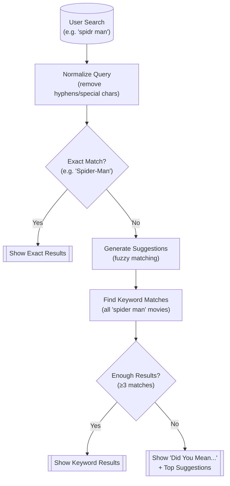
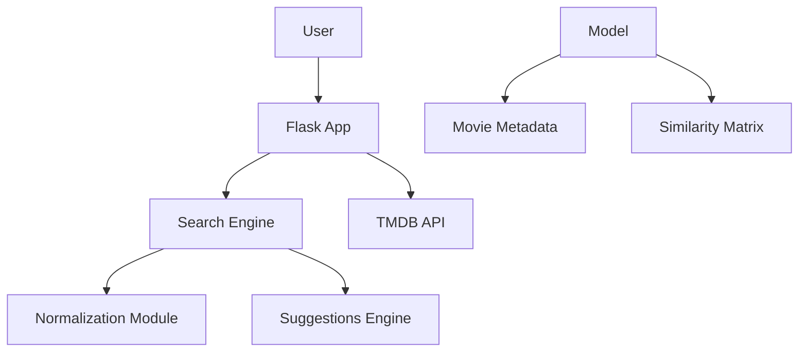

# TMDB Movie Recommendation System

## Table of Contents
- [Overview](#overview)
- [Features](#features)
  - [Intelligent Search](#intelligent-search)
  - [Rich Interface](#rich-interface)
  - [Smart Suggestion Technique](#smart-suggestion-technique)
- [Data Flow](#data-flow)
  - [Download Dataset](#dataset)
  - [Data Preprocessing](#data-preprocessing)
  - [Libraries Description](#libraries-description)
- [File Structure](#file-structure)
- [Dependencies](#dependencies)
- [Installation](#installation)
- [Technical Architecture](#technical-architecture)
- [Technical Implementation](#techinal-implementation)
- [Future Enhancements](#future-enhancements)
- [Contributing](#contributing)
- [License](#license)
- [Contact](#contact)


## Overview
This **Movie Recommendation System** is a Flask-based web application that helps users discover films based on their search queries. It intelligently corrects typos (e.g., "avngers" → "avengers") and suggests relevant movies even when titles are misspelled or formatted differently (e.g., "spider man" matches "Spider-Man"). This system bridges the gap between imperfect user queries and accurate movie discovery, making it easier to find films even with typos or formatting inconsistencies.


## Features

### Intelligent Search

- **Hyphen/Special Character Resilient**: Finds the original movie on any search, even if it contains special characters, spaces, or hyphens.
- **Fuzzy Matching**: Suggests corrections for misspellings (e.g., "avngrs" → "Avengers") and shows the result based on the correct spelling.
- **Real-time Suggestions**: Displays results as you type with movie posters.

### Rich Interface

- **Interactive Carousel**: Browse latest releases with navigation controls
- **Movie Detail Pages**: Complete with:
  - High-resolution posters fetched from TMDB using TMDB API
  - Similar movie recommendations.
- **Responsive Design**: Works perfectly on mobile and desktop

### Smart Suggestions Technique

Content-based filtering using cosine similarity which is a comprehensive solution that handles both keyword-based results and intelligent suggestions.



- Query is normalized and compared against a dataset of around 5000 movies.
- Results ranked by:
  - Exact matches
  - Normalized title similarity
  - Partial keyword matches
  - Fuzzy match suggestions
  - Full keyword matches

**Query Normalization**

```python
# Converts all variants to comparable format
"Spider-Man" → "spiderman"
"avengers: endgame" → "avengers endgame"
"batmn" → "batmn" (preserved for correction)
```

**Keyword Search Fallback**

```python
# Searches for all keywords in titles
"iron man" → finds:
- "Iron Man"
- "Iron Man 2" 
- "Iron Man 3"
- "Man of Steel" (contains "man")
```

**Fuzzy Suggestion Engine**

```python
# Uses Levenshtein distance for typos
Input: "avngers"
Suggestions: ["avengers", "angers", "avenger"]
```

**Context-Aware Results**

```bash
Did you mean: captain america?
Showing:
- Captain America: The First Avenger
- Captain America: Civil War
```

**Partial Word Matching**

```bash
"end gam" → matches "Avengers: Endgame"
```


## Data Flow

### Dataset
The dataset is collected from Kaggle.
Download [Dataset](https://www.kaggle.com/datasets/tmdb/tmdb-movie-metadata).

### Data preprocessing:
  - Extract tags for recommendations from columns.
  - Vectorize the text data to get similar and closely related movies

### Libraries Description

| Library/Functions          | Purpose |
|----------------------------|---------|
| **`NumPy`**                | Used for working with arrays, matrices, and performing mathematical operations |
| **`Pandas`**               | Used for loading, cleaning, and transforming tabular data |
| **`CountVectorizer`** (scikit-learn) | Converts text documents into a matrix of token counts for vectorizing text for ML or similarity comparison |
| **`cosine_similarity`** (scikit-learn) | Computes cosine similarity between vectors to measure how similar two items are based on vectorized features |
| **`PorterStemmer`** (NLTK) | Reduces words to their root form (stemming) to normalize text for more effective comparison |


## File Structure

```bash
movie-recommender/
├── app.py                        # search logic and backend development
├── templates/
│   ├── base.html                 # base template
│   ├── index.html                # home page
│   └── movie.html                # movie details
│   └── query_correction.html     # search results page
├── static/
│   ├── css/
│   │   └── style.css             # styles
│   └── js/
│       └── script.js             # search bar handling
└── model/
    ├── movie_cleaned.csv         # movie data
    └── similarities.pkl          # similarity data
```


## Dependencies

```python
flask==2.3.2                    # For web framework
pandas==2.0.3                   # For data preprocessing
numpy==1.24.3                   # For data preprocessing
requests==2.31.0                # For API call
python-dotenv==1.0.0
gunicorn==20.1.0                # For production
scikit-learn==1.3.0             # For recommendation engine
python-Levenshtein==0.21.1
```

## Installation

```bash
git clone https://github.com/tshihab07/Movie-Recommendation-System.git
```
```bash
cd Movie-Recommendation-System
```

### Create a virtual environment

```bash
python -m venv .venv
source .venv/bin/activate  # Linux/Mac
.\.venv\Scripts\activate   # Windows
```

### Install all requirements

```python
pip install -r requirements.txt
```

### Run APP
```python
python app.py
```


## Technical Architecture




## Technical Implementation

- **Backend:** Python (Flask)
- **Data Processing:** Pandas, NumPy
- **Search & Suggestions:** Fuzzy matching (python-Levenshtein), keyword extraction
- **Frontend:** HTML/CSS, JavaScript (for autocomplete)
- **API Integration:** TMDB (for movie posters/details)


## Future Enhancement

This project is a content-based recommendation system. It can be improved in the future as follows:
- Collaborative filtering (user-user similarity)
- Neural embeddings (BERT for semantic search)
- Multi-Language Support. Example: "スパイダーマン" → Shows Spider-Man movies


## Contributing

Contributions are welcome! Please feel free to submit a pull request.
- Fork the project.
- Create your feature branch
- Commit changes
- Push
- Open a Pull Request


## License

This project is licensed under the [MIT License](LICENSE).


## Contact

E-mail: tushar.shihab13@gmail.com <br>
More Projects: 👉🏿 [Projects](https://github.com/tshihab07?tab=repositories)<br>
Linkedin: [Tushar Shihab](https://www.linkedin.com/in/tshihab07/)
