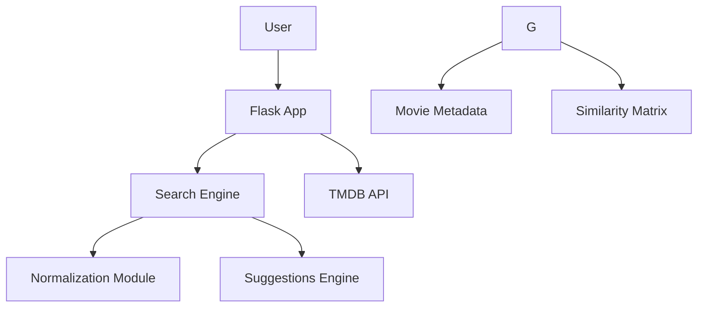

# Movie Recommendation System

## Table of Contents
- [Overview](#overview)
- [Features](#features)
  - [Intelligent Search](#intelligent-search)
  - [Rich Interface](#rich-interface)
  - [Smart Suggestion Technique](#smart-suggestion-technique)
- [Data Flow](#data-flow)
  - [Download Dataset](#dataset)
  - [Data Preprocessing](#data-preprocessing)
  - [Libraries Description](#libraries-description)
- [File Structure](#file-structure)
- [Dependencies](#dependencies)
- [Installation](#installation)
- [Technical Architecture](#technical-architecture)
- [Future Enhancements](#future-enhancements)
- [Contributing](#contributing)
- [License](#license)
- [Contact](#contact)

## Features

### Intelligent Search
- **Hyphen/Special Character Resilient**: Finds the original movie on any search, even if it contains special characters, spaces, or hyphens.
- **Fuzzy Matching**: Suggests corrections for misspellings (e.g., "avngrs" → "Avengers") and shows the result based on the correct spelling.
- **Real-time Suggestions**: Displays results as you type with movie posters.

### Rich Interface
- **Interactive Carousel**: Browse latest releases with navigation controls
- **Movie Detail Pages**: Complete with:
  - High-resolution posters fetched from TMDB using TMDB API
  - Similar movie recommendations.
- **Responsive Design**: Works perfectly on mobile and desktop

### Smart Suggestions Technique
Content-based filtering using cosine similarity which is a comprehensive solution that handles both keyword-based results and intelligent suggestions.
graph TD
    A[User Search] --> B(Normalize Query)
    B --> C{Exact Match?}
    C -->|Yes| D[Show Exact Results]
    C -->|No| E[Generate Suggestions]
    E --> F[Find Keyword Matches]
    F --> G{Enough Results?}
    G -->|Yes| H[Show Keyword Results]
    G -->|No| I[Show "Did You Mean" + Suggestions]

- Query is normalized and compared against a dataset of around 5000 movies.
- Results ranked by:
  - Exact matches
  - Normalized title similarity
  - Partial keyword matches
  - Fuzzy match suggestions
  - Full keyword matches
**Query Normalization**
```python
# Converts all variants to comparable format
"Spider-Man" → "spiderman"
"avengers: endgame" → "avengers endgame"
"batmn" → "batmn" (preserved for correction)
```

**Keyword Search Fallback**
```python
# Searches for all keywords in titles
"iron man" → finds:
- "Iron Man"
- "Iron Man 2" 
- "Iron Man 3"
- "Man of Steel" (contains "man")
```

**Fuzzy Suggestion Engine**
```python
# Uses Levenshtein distance for typos
Input: "avngers"
Suggestions: ["avengers", "angers", "avenger"]
```

**Context-Aware Results**
```bash
Did you mean: captain america?
Showing:
- Captain America: The First Avenger
- Captain America: Civil War
```

**Partial Word Matching**
```bash
"end gam" → matches "Avengers: Endgame"
```


## Data Flow
### Dataset
The dataset is collected from Kaggle.
Download [Dataset](https://www.kaggle.com/datasets/tmdb/tmdb-movie-metadata).

### Data preprocessing:
  - Extract tags for recommendations from columns.
  - Vectorize the text data to get similar and closely related movies

### Libraries Description
| <div align="left">Library Functions</div>                                                        | <div align="left">Purpose<div>                                                                                                                   |
| ------------------------------------------------------------- | ---------------------------------------------------------------------------------------------------------------------------------------------------------------------------- |
    | <p align="left">**`Numpy`**</p>                                         | <p align="Left">Used for working with arrays, matrices, and performing mathematical operations.</p>  |
    | <p align="left">**`Pandas`**</p>                                         | <p align="left">Used for loading, cleaning, and transforming tabular data.</p>                                    |
    | <p align="left">**`CountVectorizer`**</p> | <p align="left">Imports **CountVectorizer** from scikit-learn, which converts text documents into a matrix of token counts for vectorizing text for ML or similarity comparison.</p>    |
    | <p align="left">**`cosine_similarity`**</p>      | <p align="left">Used to compute **cosine similarity** between vectors for measuring how similar two items are based on vectorized features.</p>            |
    | <p align="left">**`PorterStemmer`**</p>                  | <p align="left">Imports the **Porter stemming** from NLTK, used to reduce words to their root form  that helps normalize text for more effective comparison.</p> |


## File Structure
```bash
movie-recommender/
├── app.py                        # Updated with new search logic
├── templates/
│   ├── base.html                 # Your existing base template
│   ├── index.html                # Your existing home page
│   └── query_correction.html     # NEW search results page
├── static/
│   ├── css/
│   │   └── style.css             # Updated with new styles
│   └── js/
│       └── script.js             # Updated form handling
└── model/
    ├── movie_cleaned.csv         # Your movie data
    └── similarities.pkl          # Your similarity data
```


## Dependencies
```python
flask==2.3.2                    # For web framework
pandas==2.0.3                   # For data preprocessing
numpy==1.24.3                   # For data preprocessing
requests==2.31.0                # For API call
python-dotenv==1.0.0
gunicorn==20.1.0                # For production
scikit-learn==1.3.0             # For recommendation engine
python-Levenshtein==0.21.1      # For fuzzy matching
```

## Installation
```bash
git clone https://github.com/tshihab07/Movie-Recommendation-System.git
```
```bash
cd Movie-Recommendation-System
```

### Create a virtual environment
```bash
python -m venv .venv
source .venv/bin/activate  # Linux/Mac
.\.venv\Scripts\activate   # Windows
```

### Install all requirements
```python
pip install -r requirements.txt
```

### Run APP
```python
python app.py
```


## Technical Architecture



## Future Enhancement
This project is a content-based recommendation system. It can be improved in the future as follows:
- Collaborative filtering (user-user similarity)
- Neural embeddings (BERT for semantic search)
- Multi-Language Support. Example: "スパイダーマン" → Shows Spider-Man movies


## Contributing
Contributions are welcome! Please feel free to submit a pull request.
- Fork the project.
- Create your feature branch
- Commit changes
- Push
- Open a Pull Request

## License
This project is licensed under the [MIT License](LICENSE).

## Contact
E-mail: tushar.shihab13@gmail.com
More Repositories: [Projects](https://github.com/tshihab07?tab=repositories)
Linkedin: [Tushar Shihab](https://www.linkedin.com/in/tshihab07/)
